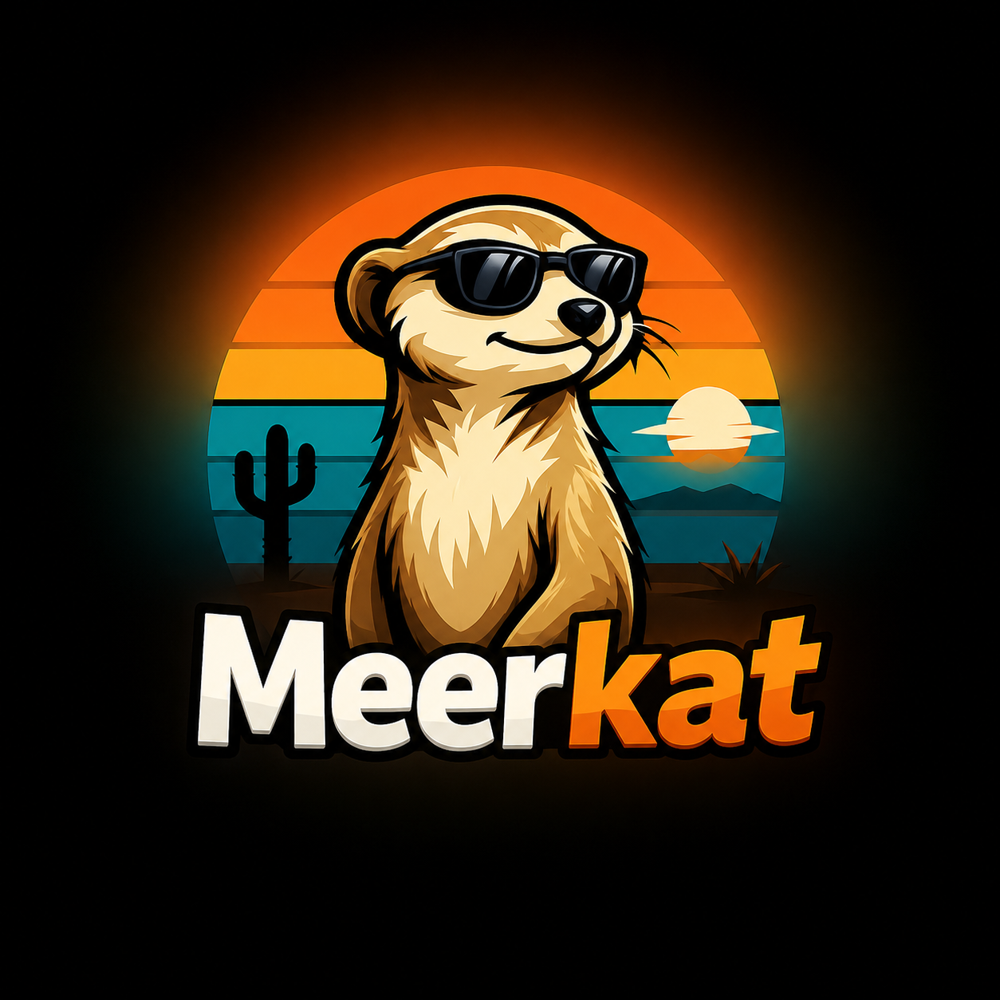

<p align="center">
  
</p>

<h1 align="center">Meerkat</h1>

<p align="center"><strong>Vibe coding without blind trust.</strong></p>

<p align="center">
  <a href="LICENSE"></a>
  <a href=".github/workflows/ci.yml"></a>
  
  
</p>

Meerkat is a local CLI security wrapper for AI coding agents and long-running developer workflows. It keeps your machine awake while agents work, and only auto-approves actions that are safe, scoped, and policy-compliant. Risky actions are blocked or escalated to a human.

Meerkat is **agent-agnostic**. Wrap `claude`, `codex`, `aider`, `goose`, `npm test`, `pytest`, or any command-line tool.

> **Meerkat is not a perfect sandbox.** It is a secure-by-default local policy runner. It will become stronger over time as OS-level sandbox backends (Landlock, Seatbelt, AppContainer) and a shell-proxy mode land. Run high-risk agent work inside a VM or container too.

---

## Why Meerkat exists

AI coding agents are useful. They are also non-deterministic processes with access to your shell, your files, your network, and your git remotes. The current "approve every step" UX is exhausting and trains users to click "yes" by reflex. The "full auto" UX is dangerous: one prompt-injected README can convince an agent to read `~/.ssh`, push secrets to `main`, or `curl | sh` a malicious payload.

Meerkat draws a line:

- **Safe, scoped, deterministic actions** → auto-approve
- **Medium-risk actions** → ask once, with reasons
- **High-risk or out-of-scope actions** → block by default

The decision engine is **rule-based, not LLM-based**. Security decisions must be predictable.

Core principles:

- **Secure by default**
- **Deny by default**
- **Least privilege**
- **Scoped autonomy**
- **Human approval for high-risk actions**
- **Auditability** — every decision logged as JSONL
- **No telemetry, no cloud, no account**

---

## Quick start

```bash
git clone https://github.com/ujjwalredd/meerkat.git
cd meerkat
go build -o /usr/local/bin/meerkat ./cmd/meerkat

cd ~/my-project
meerkat init                                # write strict default meerkat.yml
meerkat run --keep-awake -- npm test        # safe + auto-approved
meerkat run -- claude                       # wrap an AI agent
meerkat explain -- git push origin main     # see the decision without running
meerkat scan                                # secret + policy scan
meerkat doctor                              # platform diagnostics
```

Requires Go 1.22+. Prebuilt binaries: see Releases.

---

## Safe auto-approval

Meerkat resolves every command to one of three decisions, each with reasons:

| Decision | Meaning |
|----------|---------|
| `ALLOW`  | Matches `auto_approve` and `auto_approve_safe_actions: true`, or low-risk known command |
| `ASK`    | Medium risk, matches `require_approval`, or unknown command (per `mode.default_action`) |
| `BLOCK`  | Matches `commands.block`, high risk, push to protected branch, secret detected |

```text
$ meerkat explain -- git push origin main
Command: git push origin main
Decision: BLOCK
Risk: high
Reasons:
  - Push to protected branch 'main' is blocked by default
```

---

## Policy examples

See [`examples/`](examples/) for ready-to-use policies.

| Profile | Use case | Default |
|---------|----------|---------|
| [`basic`](examples/basic/meerkat.yml)   | Generic project | strict-but-usable |
| [`node`](examples/node/meerkat.yml)     | Node/npm app | npm test auto, install ASK |
| [`python`](examples/python/meerkat.yml) | Python/pytest | pytest auto, pip ASK |
| [`strict`](examples/strict/meerkat.yml) | CI / untrusted agent | `default_action: block`, no auto-approve |
| [`agent`](examples/agent/meerkat.yml)   | Wrapping a coding agent | auto-approve tests/lint, ASK everything else |

Full schema: [`docs/policy.md`](docs/policy.md).

---

## What gets auto-approved

Default policy auto-approves these when `auto_approve_safe_actions: true`:

- `npm test`, `npm run test`, `npm run build`, `npm run lint`
- `pnpm test`, `pnpm build`, `yarn test`
- `go test ./...`, `cargo test`, `pytest`
- `git status`, `git diff`

You edit `commands.auto_approve` to match what your team trusts.

## What requires approval

Asked once per invocation, with reasons rendered:

- `npm install`, `pnpm install`, `yarn add`, `pip install`, `poetry add`, `cargo add`, `go get`
- `git commit`, `git push` (to non-protected branches)
- `docker build`, `docker compose up`
- Any **unknown** command, when `mode.default_action: ask`
- Any network egress to a domain not on `network.allow_domains`

## What gets blocked

Refused outright. No prompt:

- `sudo`, `su`, privilege escalation
- `rm -rf /`, `rm -rf ~`, recursive force-removal
- `chmod -R 777`, `chown -R`
- `curl`, `wget`, `scp`, `ssh`, `nc`, `netcat` (default network egress tools)
- `git push --force`, `git push --force-with-lease`
- `git push` to `main`, `master`, `production`
- Reads of `~/.ssh`, `~/.aws`, `~/.config`, `~/Library/Application Support`
- Reads of `./.env`, `./.env.*`, `./secrets`, `./.git/config`
- Writes outside `filesystem.allowed_write_paths`
- Symlinks that point outside the project root

---

## Secret scanning

Built-in regex scanner. No external tools required.

Detects:

- AWS access keys (`AKIA…`, `ASIA…`)
- GitHub tokens (`ghp_…`, `gho_…`, `ghu_…`, `ghs_…`)
- OpenAI API keys (`sk-…`)
- Anthropic API keys (`sk-ant-…`)
- Slack tokens (`xoxb-…`, `xoxa-…`, `xoxp-…`)
- Stripe keys (`sk_live_…`, `pk_live_…`)
- Private key blocks (RSA, EC, DSA, OpenSSH, PGP)
- JWTs (`eyJ….….…`)
- Database URLs with embedded passwords
- Generic `api_key = "…"` / `password = "…"` assignments

Scan triggers:

- Before `git commit` if `secrets.scan_before_commit: true`
- Before `git push` if `secrets.scan_before_push: true`
- On demand via `meerkat scan`

Output:

```text
BLOCKED: Secret-like values detected

File: src/config.ts
Line: 12
Type: openai_api_key
Action: remove the secret and use environment variables instead
```

Secrets are **never printed in full**, and are redacted (`AKI**************EF`) in audit logs.

---

## Git protection

Default git guardrails:

- Push to `main`, `master`, `production` → **BLOCK**
- Force push or force-with-lease → **BLOCK**
- Commit → secret scan first (block on any finding)
- Push → secret scan first (block on any finding)
- Post-run: compare `git status` against `allowed_write_paths`; flag out-of-scope writes

Customize protected branches in `git.protected_branches`.

---

## Keep-awake mode

Long agent runs and builds make laptops sleep. Meerkat starts a keep-awake child process for the duration of the command and stops it on exit.

| OS | Backend | Status |
|----|---------|--------|
| macOS   | `caffeinate -imsd` | Supported |
| Linux   | `systemd-inhibit --what=idle:sleep` | Supported |
| Windows | `SetThreadExecutionState` | **Not implemented in MVP** — Meerkat warns honestly instead of faking it |

Modes: `disabled`, `while_command_running`, `duration`. Max duration enforced via `awake.max_duration_minutes`. Keep-awake always stops, even on Ctrl-C or panic.

---

## Audit logs

Every decision and event lands in `./.meerkat/logs/meerkat-YYYYMMDD-HHMMSS.jsonl`.

Event types: `run_started`, `command_classified`, `approval_requested`, `approval_granted`, `approval_denied`, `command_started`, `command_finished`, `secret_scan_started`, `secret_detected`, `git_guard_triggered`, `policy_violation`, `keep_awake_started`, `keep_awake_stopped`, `run_finished`.

Each event includes timestamp, command, decision, risk level, reasons, branch, exit code, duration. Secrets are redacted. Command output is **not** stored by default.

```jsonl
{"timestamp":"2026-05-17T15:04:05Z","event_type":"command_classified","command":"git push origin main","decision":"BLOCK","risk_level":"high","reasons":["Push to protected branch 'main' is blocked by default"]}
```

---

## Threat model

Full model: [`docs/threat-model.md`](docs/threat-model.md). Summary:

**Assets protected:** source code, local secrets, API keys, SSH keys, cloud credentials, git remotes, protected branches, the developer's machine.

**Adversaries:** misbehaving agent, prompt-injected agent, malicious dependency lifecycle script, careless user.

**Threats addressed:** secret reads, secret writes, network exfiltration, recursive destructive commands, out-of-scope writes, unsafe pushes, malicious installs (via ASK), symlink escape, shell injection (commands run via `exec.Command`, not a shell).

---

## Limitations

Honest list. Read before trusting:

- **Not a kernel sandbox.** Meerkat is a user-space policy runner. A malicious binary launched by an allowed command can do anything that binary is permitted to do.
- **Network controls are command/policy-based in MVP**, not packet-level. Meerkat detects `curl`, `wget`, `ssh`, `scp`, `nc`, `npm install`, `pip install`, etc., and applies domain allow/block lists at the command-line level. It does not install a firewall.
- **Secret scanner is regex-based.** False negatives are possible. Pair with `gitleaks` or `trufflehog` for high assurance.
- **Symlinks** are resolved with `EvalSymlinks` before scope checks. A TOCTOU window exists between resolution and use.
- **Anything launched outside `meerkat run` is not controlled.**
- **Windows keep-awake** is not implemented in MVP. Meerkat warns; it does not lie.
- **Do not run Meerkat with `sudo` or admin.** Least privilege starts with Meerkat itself.

For high-risk agent workloads, run Meerkat **inside** a container or VM.

---

## Roadmap

| Version | Plan |
|---------|------|
| v0.1    | CLI, policy, decisions, keep-awake, secret scan, git guard, audit |
| v0.2    | Better install detection, external scanners (gitleaks, trufflehog), improved Windows |
| v0.3    | Shell-proxy mode, agent adapters, MCP approval server, IDE extension |
| v0.4    | OS-level sandbox backends: Linux Landlock + seccomp, macOS Seatbelt, Windows AppContainer; network egress proxy |
| v1.0    | Stable policy format, stable CLI, signed releases, plugin system, third-party security audit |

Detailed v1 design — sandbox backends, plugin interfaces, integrations:
[`docs/v1-architecture.md`](docs/v1-architecture.md).

---

## Contributing

See [`CONTRIBUTING.md`](CONTRIBUTING.md). Ground rules:

- Security decisions stay deterministic. No LLM in the decision path.
- Default policy stays strict. Loosening defaults requires a documented threat-model rationale.
- New features that touch the network must be opt-in.
- No telemetry. Meerkat is offline-first.
- Honest documentation. Do not describe capabilities we do not have.

Report security issues privately: see [`SECURITY.md`](SECURITY.md).

---

## License

Apache-2.0. See [`LICENSE`](LICENSE).
